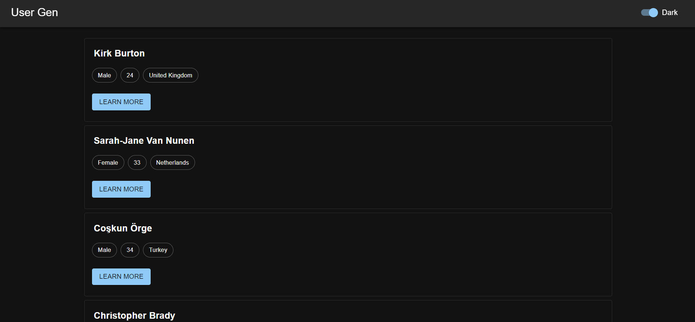
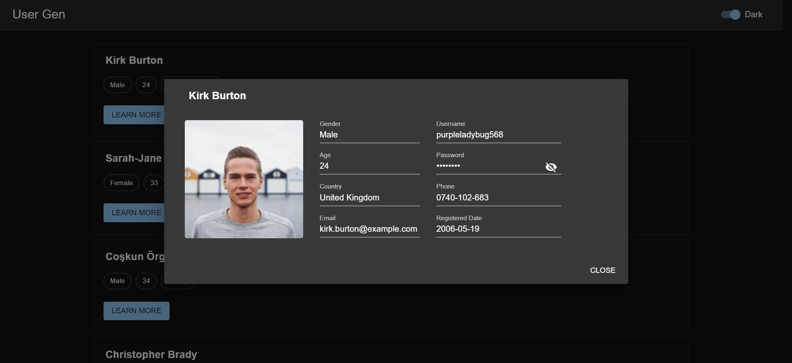
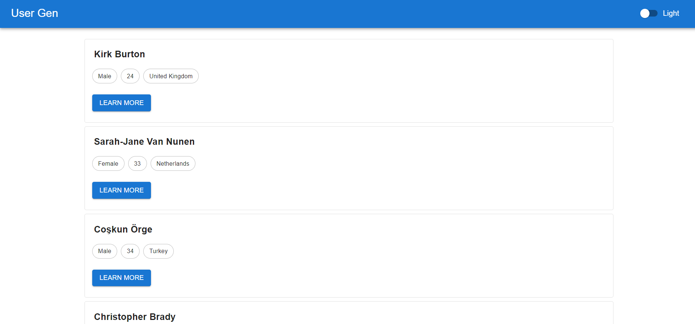
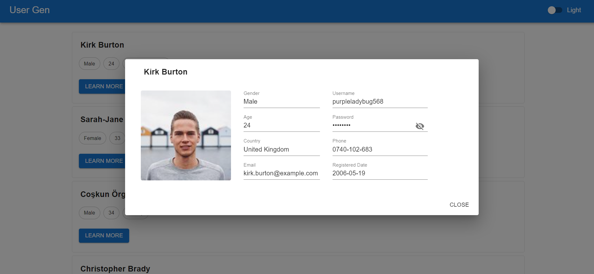

# User Gen using MUI v5, React-Query (Infinite Query), RandomUser API

NETLIFY LINK: https://react-mui-userlist.netlify.app/

### Screenshots:

### Features

- **Dark Mode** Functionality _(set default to system preference)_
- **Infinite** Scroll
- Responsive

### `yarn start`

Runs the app in the development mode.\
Open [http://localhost:3000](http://localhost:3000) to view it in your browser.
